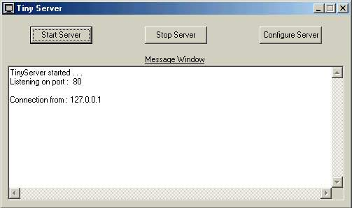



## TinyServer

### Description

TinyServer is a very basic http server. This server can accept multiple requests at once. The server is only 60 kb. The default page, webpage directory and port number can be configured. The message window provides details of connections and errors if any. The server has been configured to accept a maximum of 100 connections. I have used the Winsock control in VB. The server can be used for testing websites on a local network before uploading to the Internet. TinyServer is open source and you can freely distribute it.
 
### More Info
 
Click on Start button to start TinyServer. It will listen for connections at the specified port. The details of connections can be seen in the Message Box. TinyServer can be minimized to the system tray. After starting TinyServer type 127.0.0.1 or localhost in your browser address bar to see your website. If port has configured to a value other than 80 type 127.0.0.1:x or localhost:x where x is the port number.

TinyServer, as of now, supports only the GET request. It also does not support any server side processing. I am providing it only as an example.

             |
---                |---
**Submitted On**   |2001-08-26 00:24:46
**By**             |[Saurabh Gupta](https://github.com/Planet-Source-Code/PSCIndex/blob/master/ByAuthor/saurabh-gupta.md)
**Level**          |Advanced
**User Rating**    |3.2 (19 globes from 6 users)
**Compatibility**  |VB 5\.0, VB 6\.0
**Category**       |[Complete Applications](https://github.com/Planet-Source-Code/PSCIndex/blob/master/ByCategory/complete-applications__1-27.md)
**World**          |[Visual Basic](https://github.com/Planet-Source-Code/PSCIndex/blob/master/ByWorld/visual-basic.md)
**Archive File**   |[TinyServer253258252001\.zip](https://github.com/Planet-Source-Code/saurabh-gupta-tinyserver__1-26642/archive/master.zip)

